# Secure Password Manager
Modern, encrypted, self-hosted password manager with a beautiful animated Web UI and a fully compatible CLI interface.  
All data is encrypted locally using AES-256-GCM, with Argon2id master-password hashing, strong session security, CSRF protection, and encrypted SQLite storage.

[](https://sonarcloud.io/summary/new_code?id=skurbro_Secure_Password_Manager)
[](https://sonarcloud.io/summary/new_code?id=skurbro_Secure_Password_Manager)
[](https://sonarcloud.io/summary/new_code?id=skurbro_Secure_Password_Manager)

---

# Key Features

### Security by Design
- AES-256-GCM encryption for every field  
- Argon2id hashing for master password  
- Per-entry IV + authentication tag  
- No plaintext ever written to disk  
- Session hardening (httpOnly, SameSite=Lax)  
- Custom CSRF middleware  
- Timing-safe comparisons  
- Complete request audit logs  

### Modern Web UI
- Animated cosmic gradient background  
- Liquid-glass components with soft blur  
- Neon blue glow accents  
- Smooth transitions, pulse animations  
- Responsive layout  
- Credential management (CRUD)  
- Secure unlock screen  
- Built-in password generator  

### CLI Interface
- Fully compatible with Web UI  
- Create / unlock vault  
- Add / update / delete credentials  
- List entries  
- Only decrypted in memory  
- Writes encrypted blobs back into SQLite  

---

# Tech Stack

### Backend
- Node.js (v20)  
- TypeScript  
- Express  
- AES-256-GCM  
- Argon2id  
- SQLite  
- cookie-session  
- Custom CSRF middleware  

### Frontend
- React  
- TypeScript  
- TailwindCSS  
- Vite  

### CLI
- Node.js TypeScript  
- Same crypto engine as Web  

### DevOps
- Docker  
- Docker Compose  
- Multi-stage builds  
- SonarQube Cloud  

---

# How It Works — Detailed Technical Overview

Secure Password Manager is built as a fully encrypted local system with two interfaces (Web + CLI) using one shared vault. It provides a browser-based interface and a fully sandboxed command line interface that share a common, encrypted data format.

Essentially, what the architecture achieves is the absence of storing or transferring the master password. Instead, key derivation is done through Argon2id, AES-256-GCM credential encryption is used, and a CSRF token system that rotates along with the authenticated session is adopted. Every operation that requires sensitive information, such as decrypting the vault, creating or updating credentials, or decrypting a form field, is done within a trusted boundary on the server side, exposing only non-sensitive metadata to the client.

## Web Architecture

The web component is based on a secured Express.js server that is set up to have a “stateful yet isolated” session system. After a successful authentication process, the server associates each user session with an encrypted authentication token, as well as a short-lived CSRF token that is sent along with each state-altering request. The front-end never decrypts sensitive information; rather, it decrypts only the encrypted data or metadata. Credentials objects are decrypted only at the request level through the backend, using the authenticated vault.

The UI is designed to incorporate a neat, animated, glass-morphism aesthetic that takes inspiration from Astrum’s fluid gradients. Real-time effects such as masked glow, animated background, or interactive overlay effects are achieved through the utilization of pure CSS, along with hardware acceleration to provide smooth animations without compromising accessibility. The UI supports a range of functions such as search, sort, filter, and one-click-copy functionality to the dashboard, whereas modal views enable users to edit crypto files.

## CLI Architecture

The CLI is designed to be loosely coupled to the web stack. It runs without a server, without a session, without cookies—in fact, directly on the vault file. It’s the user who enters the master password, and that’s where Argon2id starts to generate the corresponding key structure, because all operations—create, list, update, or delete—happen on the encrypted SQLite vault. Nothing leaves the system. It’s appropriate for offline or embedded use.

The CLI interface is a replica of the logic found on the web-based interface; however, it is simpler. After locking the vault, the commands run sequentially, and changes are made atomic. It supports a safe preview, masked passwords, and confirmation on actions to refrain from accidentally executing them.

The vault is realized through a SQLite database. Here, the schemas are strictly validated, along with a two-layer cryptography system:

- a master key obtained through Argon2id from a user’s password
- Per-entry encryption keys created through deterministic HKDF
- AES-256-GCM to provide both confidentiality and integrity
- Metadata such as dates, topics, and urls stored as plaintext for convenience

- Entered secrets, such as passwords, notes, or usernames, stored as ciphertext chunks

Because of the deterministic nature of the HKDF model, the vault is able to derive all necessary materials without the need to store or regenerate master password materials.

Security Posture The whole system was analyzed for static and dynamic issues using SonarCloud, where security hotspots were resolved. The recursively copied sources were eliminated, the flags for cookies were secured, dependency installation was sanitized, and server routes were optimized. Both variants, Web and CLI, adhere to the principles of Zero Knowledge Storage, Least Privilege, and Cryptographic Correctness.

## SonarQube Verification

- All high-severity issues resolved  
- Cognitive complexity reduced  
- Dockerfile hardened  
- Session cookie flags validated  
- CSRF logic improved  

# Docker Deployment

### Build & Run
```
docker compose up --build -d
```

App: http://localhost:8080

---

# Local Development

Backend:
```
npm run dev
```

Frontend:
```
cd frontend
npm run dev
```

CLI:
```
npm run cli
```

---

# Combined Web & CLI Architecture

```mermaid
flowchart LR
    subgraph Client["🌐 Client Layer"]
        WEB["Web UI (React + Tailwind)"]
        CLI["CLI (Node.js)"]
    end

    subgraph Server["🖥 Backend (Express + TS)"]
        ROUTER["Routes"]
        MIDDLEWARE["Middleware"]
        VAULT["Vault Engine"]
    end

    subgraph Storage["🗄 Storage"]
        SQLITE["Encrypted SQLite"]
    end

    WEB --> MIDDLEWARE
    CLI --> VAULT
    MIDDLEWARE --> ROUTER
    ROUTER --> VAULT
    VAULT --> SQLITE
```



---

# Master Password Unlock Flow


---

# Credential CRUD Flow


---

# CLI Flow

```mermaid
flowchart TD
    A["Run CLI"] --> B["Enter Master Password"]
    B --> C["Argon2id"]
    C --> D["Verify Hash"]
    D --> E["Derive AES Key"]
    E --> F["Load vault.db"]
    F --> G{"Action?"}

    G -->|Add| H["Encrypt → Save"]
    G -->|List| I["Decrypt → Print"]
    G -->|Update| J["Modify → Encrypt → Save"]
    G -->|Delete| K["Remove"]
```



---

# License
MIT License.
